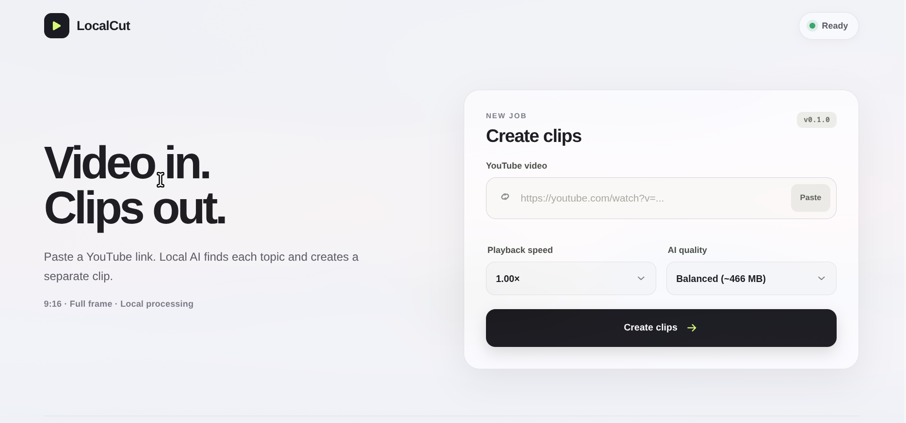

# clipAuto

Turn multi-topic YouTube videos into one vertical clip per topic. clipAuto queues the videos,
processes them locally one at a time, and exports ready-to-post 9:16 MP4 files—without a paid API
or cloud AI service.



## Quick start

### 1. Install the system tools

- Python 3.10–3.13 (3.11 or 3.12 recommended)
- [FFmpeg](https://ffmpeg.org/download.html), including `ffmpeg` and `ffprobe`
- [Ollama](https://ollama.com/download)

> [!IMPORTANT]
> Ollama is currently required. clipAuto uses it locally only to reason about topic boundaries.
> For a lightweight setup, use a text model with at least 3B parameters. `qwen3:4b` is a practical
> starting point; larger models may improve boundary decisions but need more memory.

### 2. Install clipAuto

```bash
git clone https://github.com/tospakX/clipAuto.git
cd clipAuto
python3 -m venv .venv
.venv/bin/python -m pip install --upgrade pip
.venv/bin/python -m pip install -e .
ollama pull qwen3:4b
```

If Ollama is not already running, start it in another terminal with `ollama serve`.

### 3. Check and run

```bash
.venv/bin/youtube-clipper --check
.venv/bin/youtube-clipper --ui
```

The browser opens at `http://127.0.0.1:8787`. Paste one YouTube URL or several URLs (one per line),
choose the playback speed and transcription quality, then select **Add to queue**. Keep the
terminal open while processing and stop the app with `Ctrl+C`.

The queue shows `waiting`, `downloading`, `analyzing`, `clipping`, `completed`, or `failed` for
each video. A failed video does not stop later items, and a waiting item can be removed before it
starts. Repeated forms of the same YouTube link are skipped while that video is active.

Generated files are isolated by video and use descriptive topic names:

```text
output/
└── my-video-title-abc123/
    └── clips/
        ├── 01_introduction.mp4
        └── 02_camera-setup.mp4
```

The title and YouTube ID keep similar video names separate. Folder and filenames are normalized
for Linux and Windows. The download buttons in the interface also save copies through your
browser.

## What clipAuto does

- Queues one or more YouTube videos and downloads them sequentially with `yt-dlp`.
- Reads creator chapters and timestamps from the video description when available.
- Transcribes speech locally with `faster-whisper`, including word timestamps.
- Detects visual transitions with PySceneDetect.
- Queries installed Ollama models and automatically selects a suitable local text model.
- Combines transcript markers, description timestamps, visual cuts, and Ollama reasoning.
- Exports one H.264/AAC clip per detected topic on a 1080x1920 canvas.
- Preserves the full source frame with centered padding instead of cropping or stretching it.
- Supports playback speeds from 0.50x to 2.00x while preserving audio pitch.

The default `small` Whisper model downloads about 466 MB on first use and is then cached locally.
Completed transcript and scene analysis is cached under `.clipper-work/<youtube-id>/`, keeping
sources, yt-dlp metadata, and analysis files separate while making retries faster.
Automatic GPU mode falls back to optimized CPU processing if the required CUDA runtime is absent.

## Command-line usage

Run the pipeline without the graphical interface:

```bash
.venv/bin/youtube-clipper "https://www.youtube.com/watch?v=VIDEO_ID"
.venv/bin/youtube-clipper "https://www.youtube.com/watch?v=VIDEO_ID" --speed 1.5
.venv/bin/youtube-clipper "https://youtu.be/FIRST_ID" "https://youtu.be/SECOND_ID"
```

CLI URLs are processed in order. If one fails, the remaining URLs still run and the command exits
with status `1` after the queue finishes.

Useful controls:

```bash
.venv/bin/youtube-clipper URL --whisper-model medium
.venv/bin/youtube-clipper URL --whisper-device cpu --whisper-compute-type int8
.venv/bin/youtube-clipper URL --output-dir my-clips --work-dir my-work
```

Fish users do not need to activate the environment when using the commands above. To activate it
anyway, run `source .venv/bin/activate.fish`.

## How topic boundaries are chosen

The detector combines four signals:

1. Timestamped speech and explicit phrases such as `1`, `number two`, `next topic`, and
   `moving on to`.
2. Creator timestamps and structured YouTube chapters.
3. PySceneDetect visual transitions as supporting evidence.
4. Local Ollama reasoning about genuine topic changes.

Scene cuts alone never create a topic. Description timestamps are deduplicated against structured
chapters, isolated time mentions need supporting evidence, and short edge clips are suppressed.
A complete creator chapter map also prevents ordinary camera cuts or narrative progression from
splitting one topic into multiple clips.

## Project status

Version `0.1.0` is ready for its first tagged release. The processing pipeline is modular, with
product defaults in `youtube_clipper/config.py` and each stage isolated in its own component. See
the [architecture guide](docs/architecture.md), [changelog](CHANGELOG.md), and
[contribution guide](CONTRIBUTING.md) for development details.

## Development checks

```bash
.venv/bin/python -m pip install -e '.[dev]'
.venv/bin/ruff check .
.venv/bin/python -m unittest discover -v
.venv/bin/python -m build
```

Tests cover marker recognition, multi-signal boundary fusion, model selection, Whisper runtime
fallback, AV1 scene compatibility, FFmpeg export arguments, safe output naming, sequential queue
and failure isolation, the UI server, and pipeline-stage orchestration. GitHub Actions runs tests
on Python 3.10–3.13 plus lint and package builds.

## Donations

- Bitcoin (BTC): `bc1qrmlkg6r84m83w72c2f5hw3n8j06k7s5phfws67`
- Litecoin (LTC): `La25t2KDaondzHUbrDf64cyQpjZTbo6hyt`

## Development note

Codex was used in a limited supporting role for debugging and frontend work.

## License

No license is granted. The repository has no `LICENSE` file and remains all rights reserved by
default.
